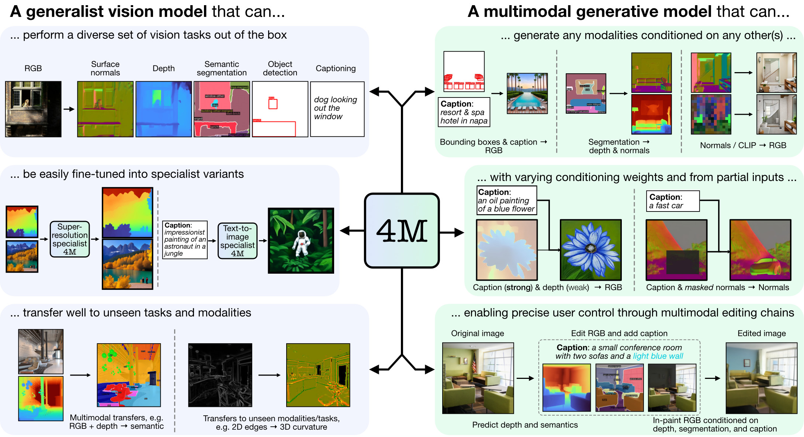

# 4M: Massively Multimodal Masked Modeling

David Mizrahi*, Roman Bachmann*, Oğuzhan Fatih Kar, Teresa Yeo, Mingfei Gao, Afshin Dehghan, Amir Zamir

[`Website`](https://4m.epfl.ch) | [`Paper`](https://arxiv.org/abs/2312.06647) | [`BibTeX`](#citation)  


Official implementation and pre-trained models for "4M: Massively Multimodal Masked Modeling" (NeurIPS 2023 Spotlight).

<p align="center">

</p>

4M is a framework for training "any-to-any" foundation models, using tokenization and masking to scale to many diverse modalities. Models trained using 4M can perform a wide range of vision tasks, transfer well to unseen tasks and modalities, and are flexible and steerable multimodal generative models. We are releasing the code in several stages, starting with our NeurIPS 23 paper "4M: Massively Multimodal Masked Modeling" (here denoted 4M-7) and transitioning to our current work "Scaling Vision Models to Tens of Tasks and Modalities" (here denoted 4M-21).


## Model Zoo

We provide 4M and tokenizer checkpoints as [safetensors](https://huggingface.co/docs/safetensors/en/index), and also offer easy loading via [Hugging Face Hub](https://huggingface.co/docs/hub/index).

### 4M models

| Model   | # Mod. | Datasets | # Params | Config | Weights         |
| ------- | ------ | -------- | -------- | ------ | --------------- |
| 4M-B | 7 | CC12M | 198M | [Config](cfgs/default/4m/models/main/4m-b_mod7_500b.yaml) | [Checkpoint](https://huggingface.co/EPFL-VILAB/4M/resolve/main/4M-7_B_CC12M.safetensors) / [HF Hub](https://huggingface.co/EPFL-VILAB/4M-7_B_CC12M) |
| 4M-B | 7 | COYO700M | 198M | [Config](cfgs/default/4m/models/main/4m-b_mod7_500b.yaml) | [Checkpoint](https://huggingface.co/EPFL-VILAB/4M/resolve/main/4M-7_B_COYO700M.safetensors) / [HF Hub](https://huggingface.co/EPFL-VILAB/4M-7_B_COYO700M) |
| 4M-L | 7 | CC12M | 705M | [Config](cfgs/default/4m/models/main/4m-l_mod7_500b.yaml) | [Checkpoint](https://huggingface.co/EPFL-VILAB/4M/resolve/main/4M-7_L_CC12M.safetensors) / [HF Hub](https://huggingface.co/EPFL-VILAB/4M-7_L_CC12M) |
| 4M-L | 7 | COYO700M | 705M | [Config](cfgs/default/4m/models/main/4m-l_mod7_500b.yaml) | [Checkpoint](https://huggingface.co/EPFL-VILAB/4M/resolve/main/4M-7_L_COYO700M.safetensors) / [HF Hub](https://huggingface.co/EPFL-VILAB/4M-7_L_COYO700M) |
| 4M-XL | 7 | CC12M | 2.8B | [Config](cfgs/default/4m/models/main/4m-xl_mod7_500b.yaml) | [Checkpoint](https://huggingface.co/EPFL-VILAB/4M/resolve/main/4M-7_XL_CC12M.safetensors) / [HF Hub](https://huggingface.co/EPFL-VILAB/4M-7_XL_CC12M) |
| 4M-XL | 7 | COYO700M | 2.8B | [Config](cfgs/default/4m/models/main/4m-xl_mod7_500b.yaml) | [Checkpoint](https://huggingface.co/EPFL-VILAB/4M/resolve/main/4M-7_XL_COYO700M.safetensors) / [HF Hub](https://huggingface.co/EPFL-VILAB/4M-7_XL_COYO700M) |

To load models from Hugging Face Hub:
```python
from fourm.models.fm import FM

fm7b_cc12m  = FM.from_pretrained('EPFL-VILAB/4M-7_B_CC12M')
fm7b_coyo   = FM.from_pretrained('EPFL-VILAB/4M-7_B_COYO700M')

fm7l_cc12m  = FM.from_pretrained('EPFL-VILAB/4M-7_L_CC12M')
fm7l_coyo   = FM.from_pretrained('EPFL-VILAB/4M-7_L_COYO700M')

fm7xl_cc12m = FM.from_pretrained('EPFL-VILAB/4M-7_XL_CC12M')
fm7xl_coyo  = FM.from_pretrained('EPFL-VILAB/4M-7_XL_COYO700M')
```

To load the checkpoints manually, first download the safetensors files from the above links and call:
```python
from fourm.utils import load_safetensors
from fourm.models.fm import FM

ckpt, config = load_safetensors('/path/to/checkpoint.safetensors')
fm = FM(config=config)
fm.load_state_dict(ckpt)
```

### 4M text-to-image specialist models

These models were initialized with the standard 4M-7 CC12M models, but continued training with a modality mixture heavily biased towards text inputs. They are still able to perform all other tasks, but perform better at text-to-image generation compared to the non-finetuned models.

| Model   | # Mod. | Datasets | # Params | Config | Weights         |
| ------- | ------ | -------- | -------- | ------ | --------------- |
| 4M-T2I-B | 7 | CC12M | 198M | [Config](cfgs/default/4m/models/specialized/4m-b_mod7_500b--spec_text2im_100b.yaml) | [Checkpoint](https://huggingface.co/EPFL-VILAB/4M/resolve/main/4M-7-T2I_B_CC12M.safetensors) / [HF Hub](https://huggingface.co/EPFL-VILAB/4M-7-T2I_B_CC12M) |
| 4M-T2I-L | 7 | CC12M | 705M | [Config](cfgs/default/4m/models/specialized/4m-l_mod7_500b--spec_text2im_100b.yaml) | [Checkpoint](https://huggingface.co/EPFL-VILAB/4M/resolve/main/4M-7-T2I_L_CC12M.safetensors) / [HF Hub](https://huggingface.co/EPFL-VILAB/4M-7-T2I_L_CC12M) |
| 4M-T2I-XL | 7 | CC12M | 2.8B | [Config](cfgs/default/4m/models/specialized/4m-xl_mod7_500b--spec_text2im_100b.yaml) | [Checkpoint](https://huggingface.co/EPFL-VILAB/4M/resolve/main/4M-7-T2I_XL_CC12M.safetensors) / [HF Hub](https://huggingface.co/EPFL-VILAB/4M-7-T2I_XL_CC12M) |

To load models from Hugging Face Hub:
```python
from fourm.models.fm import FM

fm7b_t2i_cc12m  = FM.from_pretrained('EPFL-VILAB/4M-7-T2I_B_CC12M')
fm7l_t2i_cc12m  = FM.from_pretrained('EPFL-VILAB/4M-7-T2I_L_CC12M')
fm7xl_t2i_cc12m  = FM.from_pretrained('EPFL-VILAB/4M-7-T2I_XL_CC12M')
```

Loading manually from checkpoints is performed in the same way as above for the base 4M models.

### 4M super-resolution models

| Model   | # Mod. | Datasets | # Params | Config | Weights         |
| ------- | ------ | -------- | -------- | ------ | --------------- |
| 4M-SR-L | 7 | CC12M | 198M | [Config](cfgs/default/4m/models/superres/4m-l_mod7_500b--sr_448_100b.yaml) | [Checkpoint](https://huggingface.co/EPFL-VILAB/4M/resolve/main/4M-7-SR_L_CC12M.safetensors) / [HF Hub](https://huggingface.co/EPFL-VILAB/4M-7-SR_L_CC12M) |

To load models from Hugging Face Hub:
```python
from fourm.models.fm import FM

fm7l_sr_cc12m  = FM.from_pretrained('EPFL-VILAB/4M-7-SR_L_CC12M')
```

Loading manually from checkpoints is performed in the same way as above for the base 4M models.

### Tokenizers

| Tokenizer                  | Resolution | Codebook size | Diffusion decoder | Weights |
|----------------------------|------------|---------------|-------------------|---------|
| RGB                        | 224-448    | 16k           | ✓                 | [Checkpoint](https://huggingface.co/EPFL-VILAB/4M/resolve/main/4M_tokenizers_rgb_16k_224-448.safetensors) / [HF Hub](https://huggingface.co/EPFL-VILAB/4M_tokenizers_rgb_16k_224-448) |
| Depth                      | 224-448    |  8k           | ✓                 | [Checkpoint](https://huggingface.co/EPFL-VILAB/4M/resolve/main/4M_tokenizers_depth_8k_224-448.safetensors) / [HF Hub](https://huggingface.co/EPFL-VILAB/4M_tokenizers_depth_8k_224-448) |
| Normals                    | 224-448    |  8k           | ✓                 | [Checkpoint](https://huggingface.co/EPFL-VILAB/4M/resolve/main/4M_tokenizers_normal_8k_224-448.safetensors) / [HF Hub](https://huggingface.co/EPFL-VILAB/4M_tokenizers_normal_8k_224-448) |
| COCO semantic segmentation | 224-448    |  4k           | ✗                 | [Checkpoint](https://huggingface.co/EPFL-VILAB/4M/resolve/main/4M_tokenizers_semseg_4k_224-448.safetensors) / [HF Hub](https://huggingface.co/EPFL-VILAB/4M_tokenizers_semseg_4k_224-448) |
| CLIP-B/16                  | 224-448    |  8k           | ✗                 | [Checkpoint](https://huggingface.co/EPFL-VILAB/4M/resolve/main/4M_tokenizers_CLIP-B16_8k_224-448.safetensors) / [HF Hub](https://huggingface.co/EPFL-VILAB/4M_tokenizers_CLIP-B16_8k_224-448) |

To load models from Hugging Face Hub:
```python
from fourm.vq.vqvae import VQVAE, DiVAE

tok_rgb = DiVAE.from_pretrained('EPFL-VILAB/4M_tokenizers_rgb_16k_224-448')
tok_depth = DiVAE.from_pretrained('EPFL-VILAB/4M_tokenizers_depth_8k_224-448')
tok_normal = DiVAE.from_pretrained('EPFL-VILAB/4M_tokenizers_normal_8k_224-448')
tok_semseg = VQVAE.from_pretrained('EPFL-VILAB/4M_tokenizers_semseg_4k_224-448')
tok_clip = VQVAE.from_pretrained('EPFL-VILAB/4M_tokenizers_CLIP-B16_8k_224-448')
```

To load the checkpoints manually, first download the safetensors files from the above links and call:
```python
from fourm.utils import load_safetensors
from fourm.vq.vqvae import VQVAE, DiVAE

ckpt, config = load_safetensors('/path/to/checkpoint.safetensors')
tok = VQVAE(config=config) # Or DiVAE for models with a diffusion decoder
tok.load_state_dict(ckpt)
```


## Usage

### Installation

1. Clone this repository and navigate to the root directory:
```
git clone https://github.com/apple/ml-4m
cd ml-4m
```

2. Create a new conda environment, then install the package and its dependencies:
```
conda create -n fourm python=3.9 -y
conda activate fourm
pip install --upgrade pip  # enable PEP 660 support
pip install -e .
```

3. Verify that CUDA is available in PyTorch by running the following in a Python shell:
```
# Run in Python shell
import torch
print(torch.cuda.is_available())  # Should return True
```
If CUDA is not available, consider re-installing PyTorch following the [official installation instructions](https://pytorch.org/get-started/locally/). Likewise, if you want to install xFormers (optional, for faster tokenizers), follow [their README](https://github.com/facebookresearch/xformers) to ensure that the CUDA version is correct.


### Data  

See [README_DATA.md](README_DATA.md) for instructions on how to prepare aligned multimodal datasets.

### Tokenization  

See [README_TOKENIZATION.md](README_TOKENIZATION.md) for instructions on how to train modality-specific tokenizers.

### 4M Training

See [README_TRAINING.md](README_TRAINING.md) for instructions on how to train 4M models.

### Generation

See [README_GENERATION.md](README_GENERATION.md) for instructions on how to use 4M models for inference / generation. We also provide a [generation notebook](notebooks/generation.ipynb) that contains examples for 4M inference, specifically performing conditional image generation and common vision tasks (i.e. RGB-to-All).

## License

The code in this repository is released under the Apache 2.0 license as found in the [LICENSE](LICENSE) file.

The model weights in this repository are released under the Sample Code license as found in the [LICENSE_WEIGHTS](LICENSE_WEIGHTS) file.

## Citation

If you find this repository helpful, please consider citing our work:
```
@inproceedings{mizrahi20234m,
    title={{4M}: Massively Multimodal Masked Modeling},
    author={David Mizrahi and Roman Bachmann and O{\u{g}}uzhan Fatih Kar and Teresa Yeo and Mingfei Gao and Afshin Dehghan and Amir Zamir},
    booktitle={Thirty-seventh Conference on Neural Information Processing Systems},
    year={2023},
}
```